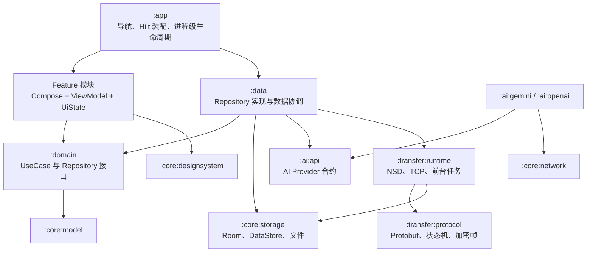
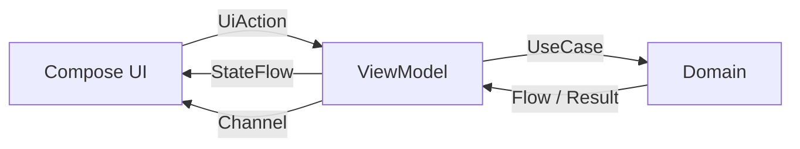
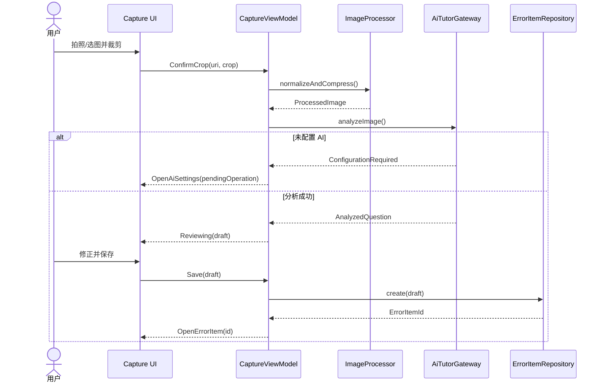
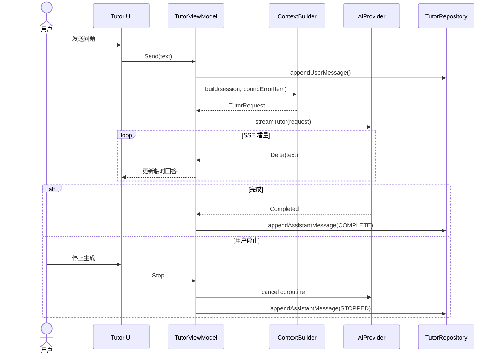

# 伴读题集 Android App 详细设计

| 项目 | 内容 |
| --- | --- |
| 文档状态 | 首版实施设计 |
| 文档版本 | 1.0 |
| 更新日期 | 2026-06-11 |
| 产品名称 | 伴读题集 |
| Android 包名 | `com.bandu.tiji` |
| Android 工程目录 | `android/` |
| 需求基线 | [proposal.md](./proposal.md) |

## 1. 设计目标

本设计将 [proposal.md](./proposal.md) 中的首版需求落为可实施的 Android 架构。实现应满足以下约束：

1. 使用 Kotlin 和 Jetpack Compose，仅支持 Android 12 及以上手机竖屏。
2. 业务数据完全本地化，AI 请求和用户主动发起的局域网迁移是仅有的对外数据流。
3. Feature 模块之间不直接依赖；它们通过 Domain 接口、稳定数据模型和导航意图协作。
4. Room、AI Provider、局域网协议均有可替换接口，可以在 JVM 测试中使用 Fake 实现。
5. 设备迁移使用隔离导入和原子切换，任何失败都不能破坏目标设备原数据。
6. 本文档只覆盖首版需求，不增加账号、云同步、自动同步、打印、文件备份或 GeoGebra。

## 2. 技术基线

### 2.1 SDK 与构建工具

| 项目 | 固定版本 | 选择说明 |
| --- | --- | --- |
| `minSdk` | 31 | 对应 Android 12，满足 `PRD-NFR-001` |
| `compileSdk` / `targetSdk` | 36 | Android 16 SDK 的稳定 API 级别 |
| Android Gradle Plugin | 9.2.1 | 当前 9.2 稳定修订版 |
| Gradle | 9.4.1 | AGP 9.2 官方兼容版本 |
| JDK | 17 | AGP 9.2 官方要求 |
| Kotlin | AGP 内置 Kotlin 2.3.10 | 使用 AGP 9.x Built-in Kotlin，避免额外 KGP 生命周期 |
| KSP | 2.3.9 | Room 与 Hilt 的符号处理器 |
| Compose BOM | 2026.05.01 | Google Maven 于 2026-06-11 公布的最新稳定组合 |

版本依据：

- [Android Gradle Plugin 9.2 release notes](https://developer.android.com/build/releases/agp-9-2-0-release-notes)
- [Android 16 SDK setup](https://developer.android.com/about/versions/16/setup-sdk)
- [Compose BOM mapping](https://developer.android.com/develop/ui/compose/bom/bom-mapping)
- [KSP releases](https://github.com/google/ksp/tags)

### 2.2 主要依赖

| 能力 | 版本 | 用途 |
| --- | --- | --- |
| Room | 2.8.4 | 业务数据库、FTS、事务、Paging Source |
| Navigation Compose | 2.9.8 | 类型安全页面导航 |
| Lifecycle | 2.10.0 | ViewModel、`StateFlow` 生命周期收集 |
| DataStore | 1.2.1 | 便携设置与设备本地设置 |
| CameraX | 1.6.1 | 相机预览和拍照 |
| Dagger/Hilt | 2.59.2 | 依赖注入 |
| AndroidX Hilt | 1.3.0 | Compose 导航与 ViewModel 集成 |
| OkHttp | 5.4.0 | Gemini、OpenAI-compatible HTTP 与 SSE |
| Coil | 3.4.0 | 私有文件图片缩略图与内存缓存 |
| Protocol Buffers | 4.32.1 | 迁移清单、记录和协议消息 |
| Protobuf Gradle Plugin | 0.9.5 | Protobuf Kotlin/Java Lite 代码生成 |
| Nimbus SRP | 2.1.0 | SRP-6a 客户端/服务端计算 |
| kotlinx-coroutines | 1.10.2 | 并发、取消、Flow |
| kotlinx-serialization-json | 1.9.0 | 类型安全导航参数和少量本地 JSON |

版本来源：

- [Room](https://developer.android.com/jetpack/androidx/releases/room)
- [Navigation](https://developer.android.com/jetpack/androidx/releases/navigation)
- [Lifecycle](https://developer.android.com/jetpack/androidx/releases/lifecycle)
- [DataStore](https://developer.android.com/jetpack/androidx/releases/datastore)
- [CameraX](https://developer.android.com/jetpack/androidx/releases/camera)
- [Hilt Gradle setup](https://dagger.dev/hilt/gradle-setup)
- [AndroidX Hilt](https://developer.android.com/jetpack/androidx/releases/hilt)
- [OkHttp changelog](https://square.github.io/okhttp/changelogs/changelog/)
- [Coil changelog](https://coil-kt.github.io/coil/changelog/)
- [Nimbus SRP](https://connect2id.com/products/nimbus-srp)

所有版本集中在 `android/gradle/libs.versions.toml`。禁止在子模块脚本中声明游离版本。依赖升级必须先运行完整测试矩阵，不使用 alpha、beta 或 RC 版本。

## 3. 总体架构

### 3.1 分层



分层含义：

- Feature 负责页面和用户操作，不知道 Room、OkHttp、NSD 或具体 AI 服务。
- Domain 定义 App 能做什么，不定义如何存储或如何联网。
- Data 把本地存储、AI 和迁移能力组合为 Domain Repository。
- 基础设施模块通过接口隔离，可在测试中替换。

### 3.2 单向数据流

每个页面遵循以下固定结构：



- `UiState`：可重放、可恢复的页面状态。
- `UiAction`：用户操作或系统回调。
- `UiEffect`：提示、导航、打开系统选择器等一次性事件。
- ViewModel 不持有 `Activity`、`Context` 或 Compose 类型。
- 进程被系统回收后，路由 ID 和未提交表单 ID 通过 `SavedStateHandle` 恢复。

### 3.3 模块依赖规则

1. Feature 模块不能依赖其他 Feature 模块。
2. `:domain` 只能依赖 `:core:model`、`:core:common` 和 Kotlin 标准库。
3. `:ai:api` 与 `:transfer:protocol` 必须是纯 JVM 模块，不依赖 Android。
4. `:data` 实现 Domain 接口，但 Compose UI 不能直接调用 Data 实现。
5. `:app` 是唯一知道全部 Feature 的模块，负责导航意图到目的地的映射。
6. 模块间公开类型只放在 `api`/public package；Room Entity、网络 DTO 和 Protobuf 生成类不得泄露到 Domain。

## 4. Gradle 模块设计

共 22 个模块。

| # | 模块 | 职责 | 主要需求 |
| --- | --- | --- | --- |
| 1 | `:app` | Application、MainActivity、NavHost、Hilt 装配、全局错误边界 | `PRD-NAV-*` |
| 2 | `:core:common` | `Result`、Dispatcher、Clock、UUID、日志接口 | `PRD-SEC-004` |
| 3 | `:core:model` | Domain 数据类、枚举、查询条件、导航意图 | `PRD-DATA-*` |
| 4 | `:core:designsystem` | 主题、通用卡片、按钮、Markdown/LaTeX、图表组件 | `PRD-HOME-002`, `PRD-LIB-014` |
| 5 | `:core:storage` | Room、FTS、DataStore、图片文件、Keystore、双存储槽 | `PRD-DATA-*`, `PRD-SEC-*` |
| 6 | `:core:network` | OkHttp、SSE、端点策略、脱敏拦截器 | `PRD-AI-008` 至 `PRD-AI-010` |
| 7 | `:core:testing` | Fake Repository、MainDispatcherRule、Fixture、Flow 断言 | `PRD-NFR-008` |
| 8 | `:domain` | Repository 接口和 UseCase | 全部业务需求 |
| 9 | `:data` | Repository 实现、Mapper、事务协调、统计查询 | `PRD-LIB-*`, `PRD-STAT-*` |
| 10 | `:ai:api` | AI Provider、请求、流事件、错误和提示词合约 | `PRD-AI-*`, `PRD-TUT-*` |
| 11 | `:ai:gemini` | Gemini REST/SSE 适配 | `PRD-AI-001` |
| 12 | `:ai:openai` | OpenAI-compatible Chat Completions/SSE 适配 | `PRD-AI-001` |
| 13 | `:transfer:protocol` | Protobuf、SRP、帧加密、迁移状态机 | `PRD-DEV-004` 至 `PRD-DEV-018` |
| 14 | `:transfer:runtime` | NSD、TCP、Foreground Service、分块读写 | `PRD-DEV-*` |
| 15 | `:feature:home` | 首页四卡片 | `PRD-HOME-*` |
| 16 | `:feature:capture` | 相机、相册、裁剪、分析、确认编辑 | `PRD-CAP-*` |
| 17 | `:feature:library` | 题集、列表、详情、搜索、筛选、批量删除 | `PRD-LIB-*` |
| 18 | `:feature:tags` | 标准标签树与自定义标签 | `PRD-TAG-*` |
| 19 | `:feature:stats` | 错题与练习统计 | `PRD-STAT-*` |
| 20 | `:feature:tutor` | 会话、流式辅导、变式题、批改 | `PRD-TUT-*` |
| 21 | `:feature:devices` | 发现、配对、迁移、信任管理 | `PRD-DEV-*` |
| 22 | `:feature:profile` | 学生资料、AI 设置、数据管理、关于 | `PRD-PRO-*`, `PRD-AI-*` |

Feature 的标准目录：

```text
feature/<name>/src/main/kotlin/com/bandu/tiji/feature/<name>/
├── <Name>Route.kt
├── <Name>Screen.kt
├── <Name>ViewModel.kt
├── <Name>Contract.kt
└── component/
```

`Contract.kt` 包含 `UiState`、`UiAction` 和 `UiEffect`。页面内部组件默认 `internal`，只有 Route 入口公开。

## 5. App 外壳与导航

### 5.1 根界面

`MainActivity` 使用单 Activity Compose 架构：

```kotlin
@AndroidEntryPoint
class MainActivity : ComponentActivity()
```

`BanduTijiApp` 包含：

- `Scaffold`
- 类型安全 `NavHost`
- 五项底部导航
- 中央圆形新增按钮
- 全局 Snackbar Host
- 迁移进行中的不可关闭状态提示

底部导航目的地：

```kotlin
@Serializable data object HomeDestination
@Serializable data object DevicesDestination
@Serializable data object CaptureDestination
@Serializable data object TutorSessionsDestination
@Serializable data object ProfileDestination
```

二级路由使用 UUID 字符串参数，例如：

```kotlin
@Serializable data class ErrorItemDetailDestination(val errorItemId: String)
@Serializable data class TutorSessionDestination(
    val sessionId: String?,
    val errorItemId: String?,
)
```

Feature 不直接调用另一 Feature 的 Route。ViewModel 发出：

```kotlin
sealed interface NavigationIntent {
    data object OpenCapture : NavigationIntent
    data class OpenCollection(val collectionId: String) : NavigationIntent
    data class OpenErrorItem(val errorItemId: String) : NavigationIntent
    data class OpenTutor(val errorItemId: String?) : NavigationIntent
    data object OpenAiSettings : NavigationIntent
}
```

`:app` 收集意图并执行导航，满足模块独立性要求。

### 5.2 视觉规范

需求追溯：`PRD-HOME-002`、`PRD-NFR-010`。

- 只提供浅色主题；系统深色模式下仍保持产品浅色主题。
- 背景：白色；次级背景：中性浅灰。
- 主文字：近黑；次级文字：中灰；危险操作：红色。
- 卡片圆角 12 dp，边框 1 dp，低海拔阴影。
- 页面水平边距 16 dp，卡片间距 12 dp。
- 中央新增按钮直径 64 dp，其他底部导航触摸目标不小于 48 dp。
- App 图标由 `public/icons/icon.png` 生成 Android adaptive icon 前景和普通图标资源。
- Markdown 使用 CommonMark + GFM 表格解析；LaTeX 使用本地渲染，不通过 WebView 加载远程内容。

Markdown/LaTeX 组件固定为 `MarkdownLatexView`：

- Compose 通过 `AndroidView` 承载受限 WebView。
- WebView 只加载 APK `assets/markdown/index.html`，其中固定打包 `markdown-it 14.1.0`、KaTeX 0.16.25 和 DOMPurify 3.3.1。
- 禁止网络请求、文件访问、内容访问、弹窗、下载、第三方 Cookie 和任意 URL 跳转。
- Kotlin 只通过 `evaluateJavascript()` 传入 JSON 编码后的 Markdown，不暴露 `addJavascriptInterface`。
- DOMPurify 删除脚本、事件属性、iframe、远程图片和危险 URL；题目内容中的 Markdown 图片语法不渲染。
- 流式回答按 250 ms 批次刷新 HTML，最终消息写入数据库后执行一次完整渲染。

### 5.3 Manifest 与运行时权限

固定声明：

```xml
<uses-permission android:name="android.permission.CAMERA" />
<uses-permission android:name="android.permission.INTERNET" />
<uses-permission android:name="android.permission.ACCESS_NETWORK_STATE" />
<uses-permission android:name="android.permission.CHANGE_WIFI_MULTICAST_STATE" />
<uses-permission android:name="android.permission.FOREGROUND_SERVICE" />
<uses-permission android:name="android.permission.FOREGROUND_SERVICE_DATA_SYNC" />
<uses-permission android:name="android.permission.POST_NOTIFICATIONS" />
```

- `CAMERA` 仅在用户选择拍照时请求；拒绝后仍可使用系统照片选择器。
- Photo Picker 不申请 `READ_MEDIA_IMAGES` 或传统存储权限。
- `POST_NOTIFICATIONS` 在首次启动迁移前请求；即使用户拒绝，也必须按系统规则提供当前迁移状态页。
- `MainActivity` 固定 `screenOrientation="portrait"`。
- 迁移 Service 声明 `foregroundServiceType="dataSync"`，只能从可见的设备迁移页面启动。

## 6. 核心 Domain 模型

```kotlin
@JvmInline value class CollectionId(val value: String)
@JvmInline value class ErrorItemId(val value: String)
@JvmInline value class TagId(val value: String)
@JvmInline value class TutorSessionId(val value: String)

enum class MasteryLevel { NEW, REVIEWING, MASTERED }
enum class MistakeStatus { WRONG_ATTEMPT, NOT_ATTEMPTED, UNKNOWN }
enum class PaperLevel { A, B, OTHER }
enum class ExerciseDifficulty { EASY, MEDIUM, HARD, CHALLENGE }
enum class GradeResult { CORRECT, INCORRECT, NEEDS_REVIEW }
enum class AiProviderType { GEMINI, OPENAI_COMPATIBLE }
```

```kotlin
data class ErrorItem(
    val id: ErrorItemId,
    val collectionId: CollectionId,
    val image: StoredImage?,
    val questionText: String,
    val answerText: String,
    val analysis: String,
    val wrongAnswerText: String,
    val mistakeStatus: MistakeStatus,
    val mistakeAnalysis: String,
    val subject: String,
    val tags: List<TagSummary>,
    val gradeSemester: String?,
    val paperLevel: PaperLevel?,
    val notes: String,
    val masteryLevel: MasteryLevel,
    val createdAtEpochMillis: Long,
    val updatedAtEpochMillis: Long,
)
```

```kotlin
data class ErrorItemQuery(
    val collectionId: CollectionId? = null,
    val keyword: String = "",
    val masteryLevels: Set<MasteryLevel> = emptySet(),
    val createdAfterEpochMillis: Long? = null,
    val tagIds: Set<TagId> = emptySet(),
    val gradeSemester: String? = null,
    val paperLevels: Set<PaperLevel> = emptySet(),
)
```

Domain 层统一使用非空正文字符串。数据库旧数据中的 `NULL` 由 Mapper 转为空字符串，不把数据库兼容性传播到 UI。

## 7. Domain 接口

### 7.1 Repository

```kotlin
interface CollectionRepository {
    fun observeCollections(): Flow<List<CollectionSummary>>
    suspend fun create(name: String): CollectionId
    suspend fun rename(id: CollectionId, name: String)
    suspend fun delete(id: CollectionId)
}

interface ErrorItemRepository {
    fun page(query: ErrorItemQuery): PagingSource<Int, ErrorItemSummary>
    fun observe(id: ErrorItemId): Flow<ErrorItem?>
    suspend fun create(draft: ErrorItemDraft): ErrorItemId
    suspend fun update(id: ErrorItemId, patch: ErrorItemPatch)
    suspend fun delete(ids: Set<ErrorItemId>)
}

interface TagRepository {
    fun observeTree(subject: String?): Flow<List<TagNode>>
    suspend fun createCustom(input: CreateTagInput): TagId
    suspend fun renameCustom(id: TagId, name: String)
    suspend fun deleteCustom(id: TagId)
}

interface TutorRepository {
    fun observeSessions(): Flow<List<TutorSessionSummary>>
    fun observeSession(id: TutorSessionId): Flow<TutorSession?>
    suspend fun getOrCreate(errorItemId: ErrorItemId?): TutorSessionId
    suspend fun appendUserMessage(sessionId: TutorSessionId, text: String): MessageId
    suspend fun appendAssistantMessage(sessionId: TutorSessionId, text: String): MessageId
    suspend fun deleteSession(id: TutorSessionId)
}

interface StatsRepository {
    fun observeWrongItemStats(): Flow<WrongItemStats>
    fun observeExerciseStats(): Flow<ExerciseStats>
}

interface ProfileRepository {
    fun observeProfile(): Flow<StudentProfile>
    suspend fun updateProfile(profile: StudentProfile)
    suspend fun clearLearningData()
    suspend fun factoryReset()
}
```

### 7.2 AI 配置与执行

```kotlin
interface AiConfigurationRepository {
    fun observeActiveConfiguration(): Flow<AiConfiguration?>
    suspend fun saveAndActivate(draft: AiConfigurationDraft): ValidationResult
    suspend fun clearApiKey()
    suspend fun savePrompt(type: PromptType, template: String)
    suspend fun resetPrompt(type: PromptType)
}

interface AiTutorGateway {
    suspend fun analyzeImage(request: AnalyzeImageRequest): AnalyzedQuestion
    fun streamTutor(request: TutorRequest): Flow<AiStreamEvent>
    suspend fun generateExercise(request: ExerciseRequest): GeneratedExercise
    suspend fun gradeExercise(request: GradeExerciseRequest): ExerciseGrade
}
```

Data 层在调用 Gateway 前检查有效配置。配置缺失返回结构化 `AiError.ConfigurationRequired`，Feature 将当前操作保存为 `PendingAiOperation` 并导航到设置。验证成功后由 `PendingOperationCoordinator` 恢复一次；失败或用户退出则清除，避免重复执行。

## 8. 本地存储设计

### 8.1 存储分区

App 私有目录按“存储槽”组织：

```text
files/
├── slots/
│   ├── slot_a/
│   │   ├── learning.db
│   │   ├── images/
│   │   └── portable.preferences_pb
│   └── slot_b/
│       ├── learning.db
│       ├── images/
│       └── portable.preferences_pb
├── transfer/
│   └── <session-id>/
└── temp/
```

设备本地且不可迁移的数据单独保存：

```text
files/device/
├── device.preferences_pb
├── trusted_peers.preferences_pb
└── api_key_ciphertext.bin
```

`device.preferences_pb` 保存活动槽、设备 UUID、设备名称、迁移提交状态和 HTTP 风险确认。活动槽指针不得放入可迁移设置。

### 8.2 Room 表

#### `collections`

| 列 | 类型 | 约束 |
| --- | --- | --- |
| `id` | TEXT | UUID，主键 |
| `name` | TEXT | 非空，`COLLATE NOCASE` |
| `created_at` | INTEGER | UTC 毫秒 |
| `updated_at` | INTEGER | UTC 毫秒 |

唯一索引：`name COLLATE NOCASE`。

#### `error_items`

| 列 | 类型 | 说明 |
| --- | --- | --- |
| `id` | TEXT PK | UUID |
| `collection_id` | TEXT FK | 删除题集时级联删除 |
| `image_path` | TEXT NULL | 相对活动槽路径 |
| `image_sha256` | TEXT NULL | 小写十六进制 |
| `image_width` / `image_height` | INTEGER NULL | 处理后尺寸 |
| `question_text` | TEXT | 非空 |
| `answer_text` | TEXT | 非空 |
| `analysis` | TEXT | 非空 |
| `wrong_answer_text` | TEXT | 非空，默认空 |
| `mistake_status` | TEXT | 三态枚举 |
| `mistake_analysis` | TEXT | 非空，默认空 |
| `subject` | TEXT | 非空 |
| `grade_semester` | TEXT NULL | 保留网页语义 |
| `paper_level` | TEXT NULL | `A/B/OTHER` |
| `notes` | TEXT | 非空，默认空 |
| `mastery_level` | INTEGER | `0/1/2` |
| `created_at` / `updated_at` | INTEGER | UTC 毫秒 |

索引：

- `(collection_id, updated_at DESC)`
- `(mastery_level, updated_at DESC)`
- `(grade_semester, paper_level)`
- `(created_at DESC)`

#### `error_item_fts`

Room `@Fts4(contentEntity = ErrorItemEntity::class)`：

- `question_text`
- `answer_text`
- `analysis`
- `wrong_answer_text`
- `mistake_analysis`
- `notes`

关键词先通过 FTS 匹配 `rowid`，再与标签、题集和枚举筛选联结。用户输入作为 `MATCH` 参数绑定，禁止拼接 SQL。

#### `tags`

| 列 | 类型 | 说明 |
| --- | --- | --- |
| `id` | TEXT PK | 系统标签使用稳定预置 UUID |
| `name` | TEXT | 标签名称 |
| `subject` | TEXT | 学科 |
| `parent_id` | TEXT NULL FK | 删除父自定义标签时子节点 `SET NULL` |
| `sort_order` | INTEGER | 展示顺序 |
| `code` | TEXT NULL | 标准目录编码 |
| `is_system` | INTEGER | 0/1 |
| `created_at` / `updated_at` | INTEGER | UTC 毫秒 |

唯一索引：`(subject, parent_id, name COLLATE NOCASE)`。

#### `error_item_tags`

复合主键 `(error_item_id, tag_id)`；两个外键均级联删除。索引 `(tag_id, error_item_id)` 用于标签筛选和计数。

#### `tutor_sessions`

| 列 | 类型 |
| --- | --- |
| `id` TEXT PK | UUID |
| `title` TEXT | 首条问题生成的本地截断标题 |
| `error_item_id` TEXT NULL FK | 错题删除时 `SET NULL` |
| `created_at` / `updated_at` INTEGER | UTC 毫秒 |

#### `tutor_messages`

| 列 | 类型 | 说明 |
| --- | --- | --- |
| `id` | TEXT PK | UUID |
| `session_id` | TEXT FK | 会话删除时级联 |
| `role` | TEXT | `USER/ASSISTANT/SYSTEM_LOCAL` |
| `content` | TEXT | Markdown |
| `status` | TEXT | `COMPLETE/STOPPED/FAILED` |
| `sequence` | INTEGER | 会话内严格递增 |
| `created_at` | INTEGER | UTC 毫秒 |

唯一索引：`(session_id, sequence)`。

#### `exercises`

| 列 | 类型 | 说明 |
| --- | --- | --- |
| `id` | TEXT PK | UUID |
| `session_id` | TEXT FK | 会话删除时级联 |
| `source_error_item_id` | TEXT NULL FK | 错题删除时 `SET NULL` |
| `subject` | TEXT | 学科 |
| `difficulty` | TEXT | 四档 |
| `question_text` | TEXT | 题目 |
| `expected_answer` | TEXT | 标准答案 |
| `analysis` | TEXT | 解析 |
| `user_answer` | TEXT NULL | 用户答案 |
| `ai_result` | TEXT NULL | AI 三态结果 |
| `final_result` | TEXT NULL | 用户覆盖后的结果 |
| `grading_feedback` | TEXT NULL | AI 反馈 |
| `graded_at` / `overridden_at` | INTEGER NULL | UTC 毫秒 |
| `created_at` | INTEGER | UTC 毫秒 |

统计只使用 `COALESCE(final_result, ai_result)`。`NEEDS_REVIEW` 不进入正确率分母。

### 8.3 DataStore

`PortablePreferences` 随迁移传输：

- 学生昵称、教育阶段、入学年份。
- 当前 Provider 类型、显示名称、Base URL、图片模型、辅导模型。
- 四类提示词模板和模板 schema 版本。

`DevicePreferences` 不传输：

- 设备 UUID、设备显示名称。
- 活动存储槽。
- 已配对设备及身份公钥。
- 本机身份密钥别名。
- 允许私有 HTTP 的风险确认。
- 当前迁移会话及提交恢复状态。

### 8.4 API Key

1. 首次保存 API Key 时，在 Android Keystore 创建 AES-256-GCM 密钥，别名为 `bandu_tiji_ai_key_v1`。
2. 每次加密使用 12 字节随机 nonce；文件保存版本、nonce、ciphertext 和 GCM tag。
3. Keystore 密钥标记为不可导出，不要求生物识别，以免后台恢复操作无法读取。
4. Key 只在发起请求前短暂解密，不写入长期对象或缓存；请求完成后立即释放引用。
5. 日志、异常、`toString()`、DataStore 和 Protobuf 均不得包含 Key。

### 8.5 图片存储

处理流程：

1. CameraX 或 Photo Picker 返回临时 URI。
2. 读取 EXIF 方向并旋正。
3. 用户裁剪。
4. 最长边缩放到不超过 1920 px。
5. JPEG 从质量 85 开始，每次降低 5，直到不超过 1 MiB或质量降至 40。
6. 去除 EXIF 和其他元数据。
7. 以 `<uuid>.jpg` 写入临时文件，`fsync` 后原子重命名到 `images/`。
8. 计算 SHA-256，并与尺寸一同写入 Room 事务。

取消或失败时删除临时文件。删除错题后，在数据库事务成功后删除图片；若文件删除失败，记录本地清理队列，下次启动重试。

### 8.6 数据库迁移

- schema 首版版本号为 1。
- 每次版本变化提供显式 `Migration(n, n+1)`。
- `MigrationTestHelper` 覆盖从每个已发布版本到当前版本。
- 禁止 `fallbackToDestructiveMigration()`。
- 系统标签使用随 APK 发布的 Protobuf/JSON 只读资产，启动时按稳定 ID upsert；只更新系统标签，不修改自定义标签。

## 9. Feature 详细设计

### 9.1 首页

需求：`PRD-HOME-*`。

`HomeUiState` 只包含昵称和四卡片的可用状态。卡片点击发出导航意图。首页不查询错题大列表，避免增加启动成本。

### 9.2 采集

需求：`PRD-CAP-*`。

状态机：

```kotlin
sealed interface CaptureStage {
    data object SelectSource : CaptureStage
    data class Crop(val tempUri: String) : CaptureStage
    data class Processing(val progress: Int) : CaptureStage
    data class Reviewing(val draftId: String) : CaptureStage
    data class Saving(val draftId: String) : CaptureStage
}
```

草稿图片和 AI 结果保存在 `files/temp/capture/<draft-id>/`，不进入正式数据库。只有用户点击保存后，`CreateErrorItemUseCase` 才把图片移入活动槽并提交数据库。

相机使用 CameraX `ImageCapture`；相册使用 Android Photo Picker，因此不申请广泛媒体读取权限。相机权限被拒绝时仍保留相册入口。



### 9.3 题集与错题

需求：`PRD-LIB-*`。

- 列表使用 Paging 3，每页 30 条，预取距离 10。
- 查询条件使用 `StateFlow<ErrorItemQuery>`，`debounce(300 ms)` 后 `flatMapLatest` 创建 Pager。
- 缩略图按列表卡片宽度解码，Coil 磁盘缓存关闭，因为原文件已是本地持久文件；启用内存缓存。
- 多选状态只保存 ID，不把完整 Entity 保存在 ViewModel。
- 编辑详情使用 `ErrorItemPatch`，每次保存一个逻辑分组；Repository 在单个 Room 事务中更新并刷新 `updated_at`。
- 删除题集、错题和批量删除使用显式确认，不实现撤销或回收站。

### 9.4 标签

需求：`PRD-TAG-*`。

- 标准标签只读。
- 自定义标签写操作由 `TagRepository` 验证重名。
- 标签树查询一次读取指定学科节点，在 Domain 中按 `parentId` 组树；禁止每个节点单独查询。
- 删除自定义标签只删除关联表记录和标签本身。

### 9.5 统计

需求：`PRD-STAT-*`。

Room DAO 直接返回聚合 DTO：

- 总错题、已掌握数、掌握率。
- 按 `subject` 聚合。
- 以设备当前时区计算最近 6 个自然月边界，再转换为 UTC 查询。
- 练习正确率分母仅为 `CORRECT + INCORRECT`。
- 活跃天数以本地日期去重。

统计不保存缓存表；数据库变化时 Flow 自动重算。5000 条基线下通过索引和聚合查询满足性能要求。

### 9.6 AI 辅导

需求：`PRD-TUT-*`。



流式文本先保存在 ViewModel 缓冲区，每接收 250 ms 批量更新 UI，避免逐 token 重组 Compose。完成、停止或失败时一次写入数据库。

### 9.7 设备

需求：`PRD-DEV-*`。

Feature 只依赖：

```kotlin
interface DeviceTransferRepository {
    fun observeNearbyDevices(): Flow<List<NearbyDevice>>
    fun observeTrustedDevices(): Flow<List<TrustedDevice>>
    fun observeTransferState(): StateFlow<TransferState>
    suspend fun startDiscovery()
    suspend fun stopDiscovery()
    suspend fun createReceiveCode(): PairingCode
    suspend fun pair(device: NearbyDevice, code: String): PairingResult
    suspend fun sendAll(target: TrustedDevice)
    suspend fun acceptTransfer(sessionId: String)
    suspend fun rejectTransfer(sessionId: String)
    suspend fun cancelTransfer()
    suspend fun forgetDevice(deviceId: String)
}
```

NSD、Socket、Foreground Service 和协议细节不进入 ViewModel。

### 9.8 我的

需求：`PRD-PRO-*`、`PRD-AI-*`。

- 学生资料保存时校验入学年份不晚于当前年份。
- AI 设置按 Provider 展示相同字段，不展示网页端 Azure 选项。
- 清除学习数据调用 `LearningDataCleaner`，只重建活动槽的学习数据库、图片和便携设置中的学习历史；保留 Profile 和 AI 设置。
- 恢复出厂设置先关闭数据库，再删除两个槽、设备设置、Key 密文和 Keystore 别名，最后生成新设备 UUID。
- 确认文本固定为“清除学习数据”和“恢复出厂设置”。

## 10. AI 子系统

### 10.1 Provider 合约

```kotlin
interface AiProvider {
    val type: AiProviderType

    suspend fun validate(configuration: ResolvedAiConfiguration): ProviderValidation

    suspend fun analyzeImage(
        configuration: ResolvedAiConfiguration,
        request: AnalyzeImageRequest,
    ): AnalyzedQuestion

    fun streamTutor(
        configuration: ResolvedAiConfiguration,
        request: TutorRequest,
    ): Flow<AiStreamEvent>

    suspend fun generateExercise(
        configuration: ResolvedAiConfiguration,
        request: ExerciseRequest,
    ): GeneratedExercise

    suspend fun gradeExercise(
        configuration: ResolvedAiConfiguration,
        request: GradeExerciseRequest,
    ): ExerciseGrade
}
```

```kotlin
sealed interface AiStreamEvent {
    data class Delta(val text: String) : AiStreamEvent
    data class Usage(val inputTokens: Long?, val outputTokens: Long?) : AiStreamEvent
    data object Completed : AiStreamEvent
}

sealed class AiError : Exception() {
    data object ConfigurationRequired : AiError()
    data object Authentication : AiError()
    data object RateLimited : AiError()
    data object Timeout : AiError()
    data object NetworkUnavailable : AiError()
    data class InvalidResponse(val diagnosticCode: String) : AiError()
    data class EndpointRejected(val reason: String) : AiError()
    data object Cancelled : AiError()
}
```

Provider 的异常必须转换为 `AiError`，原始响应正文不得直接展示或写入生产日志。

### 10.2 配置

```kotlin
data class AiConfiguration(
    val id: String,
    val displayName: String,
    val providerType: AiProviderType,
    val baseUrl: String,
    val analysisModel: String,
    val tutorModel: String,
    val hasApiKey: Boolean,
)
```

- 模型字段不提供长期硬编码默认值，用户必须填写并通过验证，避免模型下线造成静默失败。
- Gemini Base URL 默认显示官方地址，可编辑。
- OpenAI-compatible Base URL 默认显示 `https://api.openai.com/v1`，但接口实现不假设服务一定来自 OpenAI。
- 验证执行最小请求，超时 20 秒；成功后才加密保存 API Key 和激活配置。

### 10.3 提示词

四类 `PromptType`：

| 类型 | 必需占位符 |
| --- | --- |
| `ANALYZE_IMAGE` | `{{language_instruction}}`, `{{knowledge_points_list}}`, `{{grade_instruction}}`, `{{provider_hints}}` |
| `TUTOR` | `{{question_context}}`, `{{conversation_context}}`, `{{user_message}}`, `{{grade_instruction}}` |
| `GENERATE_EXERCISE` | `{{original_question}}`, `{{knowledge_points}}`, `{{difficulty_level}}`, `{{grade_instruction}}` |
| `GRADE_EXERCISE` | `{{exercise_question}}`, `{{expected_answer}}`, `{{user_answer}}`, `{{rubric_context}}` |

验证规则：

1. 必需占位符各出现至少一次。
2. 不允许未知占位符。
3. 模板 UTF-8 长度不超过 64 KiB。
4. 保存前进行一次本地渲染，渲染结果不得残留 `{{...}}`。
5. “恢复默认”恢复 APK 内相同 schema 版本的默认模板。

图片分析沿用网页端的标签输出格式，而非依赖供应商专有 JSON Schema。必须解析以下标签：

```text
<subject>
<knowledge_points>
<requires_image>
<wrong_answer_text>
<mistake_status>
<mistake_analysis>
<question_text>
<answer_text>
<analysis>
```

解析器忽略标签外空白，拒绝缺少必填标签、未知 `mistake_status`、空题目/答案/解析和超过 5 个知识点。响应无效时只自动重试一次，并附加格式纠正提示。

练习生成输出 `question_text/answer_text/analysis` 三个标签。批改输出：

```text
<grade>correct|incorrect|needs_review</grade>
<feedback>Markdown</feedback>
<confidence>0.0..1.0</confidence>
```

置信度低于 0.65 时，最终初始状态强制为 `NEEDS_REVIEW`。

### 10.4 上下文构建

需求：`PRD-TUT-006`、`PRD-TUT-007`。

采用供应商无关的字符预算，默认总预算 24,000 个 Unicode code point：

1. 系统提示和当前用户消息先计入。
2. 绑定错题预算最多 12,000 字符，优先级为题目、错误答案、错误分析、正确答案、解析、标签。
3. 超预算时只截断“解析”和“错误分析”，题目不截断；截断处添加明确标记。
4. 从最近消息向前加入完整消息，不拆分一条消息。
5. 当前用户消息始终保留。
6. 历史消息全部保存在 Room，预算只影响本次发送。

### 10.5 OpenAI-compatible

为兼容第三方服务，首版固定使用 Chat Completions 风格：

- 非流式：`POST {baseUrl}/chat/completions`
- 流式：同一端点，`stream=true`
- 图片：用户消息内容包含文本 part 与 `image_url` data URL part。
- 流式解析：按 SSE `data:` 行读取增量，遇到 `[DONE]` 或连接正常结束后完成。
- 对不支持 usage 增量的服务，Usage 字段为空，不影响功能。
- 禁用 OkHttp 自动重试写请求；仅由 Provider 根据错误类型决定重试。

OpenAI 官方的图像输入参考：[Images and vision](https://developers.openai.com/api/docs/guides/images-vision)。

### 10.6 Gemini

- 非流式：`POST {baseUrl}/v1beta/models/{model}:generateContent`
- 流式：`POST {baseUrl}/v1beta/models/{model}:streamGenerateContent?alt=sse`
- 图片使用 `inline_data`，MIME 固定为处理后文件的 `image/jpeg`。
- API Key 通过请求头发送，不拼入日志 URL。

参考：[Gemini image understanding](https://ai.google.dev/gemini-api/docs/image-understanding)。

### 10.7 Endpoint 安全策略

任意网络请求必须先通过：

```kotlin
interface EndpointPolicy {
    suspend fun validate(
        url: HttpUrl,
        allowPrivateCleartext: Boolean,
    ): EndpointDecision
}
```

规则：

- HTTPS 始终允许，证书校验使用系统 TrustManager，不提供“忽略证书”开关。
- HTTP 仅在高级开关已确认时考虑。
- HTTP Host 必须为 `localhost`、回环 IP，或 DNS 全部解析为 RFC1918 IPv4、IPv6 loopback/link-local/ULA。
- 只要存在一个公网解析地址就拒绝。
- 每次新连接和每次重定向重新验证。
- HTTP 重定向到 HTTPS允许；HTTPS 降级到 HTTP只有目标仍通过上述检查才允许。
- 所有 AI 请求必须使用受策略保护的专用 OkHttpClient，禁止 Feature 自建客户端。

由于 Android Network Security Config 无法为任意用户输入的私有 IP 动态放行，Manifest 允许 cleartext，由 `EndpointPolicyInterceptor` 实施更严格的运行时白名单。该决定需要安全测试覆盖。

### 10.8 超时与重试

| 操作 | 总超时 | 重试 |
| --- | --- | --- |
| 配置验证 | 20 秒 | 不重试 |
| 图片分析 | 180 秒 | 网络瞬断/5xx 最多 1 次 |
| 辅导首字节 | 60 秒 | 未收到任何增量时最多 1 次 |
| 辅导流总时长 | 10 分钟 | 已收到增量后不自动重试 |
| 练习生成/批改 | 120 秒 | 网络瞬断/5xx 最多 1 次 |

`401/403`、格式错误、用户取消和 Endpoint 拒绝不重试。`429` 尊重 `Retry-After`，但只提示用户手动重试。

## 11. 局域网传输设计

### 11.1 服务发现

使用 Android NSD/mDNS：

- Service type：`_bandu-tiji._tcp.`
- Service name：`BanduTiji-<discoverySuffix>`
- TXT：
  - `v=1`
  - `device=<device UUID 的 SHA-256 前 12 位>`
  - `name=<UTF-8 设备显示名称，最多 32 字符>`
  - `mode=pair|trusted`

设备只在用户打开设备页并开始发现，或明确进入接收模式时注册/扫描。离开流程后停止，满足 `PRD-DEV-003`。

### 11.2 本机身份

- 首次安装生成随机设备 UUID。
- 在 Android Keystore 生成 P-256 EC 签名密钥，私钥不可导出。
- 设备身份为 UUID、公开签名公钥和显示名称。
- 重装、恢复出厂设置或 Keystore 密钥丢失后生成新身份。

### 11.3 首次配对

目标设备作为 SRP Server，源设备作为 SRP Client：

1. 目标生成 6 位数字码、128-bit salt 和 5 分钟过期时间。
2. 配对码只显示在目标屏幕，不通过 NSD TXT 或 TCP 明文发送。
3. 使用 SRP-6a、RFC 5054 2048-bit group、SHA-256。
4. SRP 身份字符串为双方 discovery ID 按字典序拼接，防止跨会话复用。
5. 双方验证 `M1/M2` 后，以 SRP shared secret 通过 HKDF-SHA256 派生临时加密密钥。
6. 在临时认证加密通道中交换设备 UUID、签名公钥和公钥持有证明。
7. 双方界面显示对方设备名称和公钥指纹前 12 位，双方确认后写入信任列表。

安全限制：

- 最多连续失败 5 次；随后目标立即废弃配对码并等待 60 秒。
- 配对码过期、目标离开页面或 App 进入后台超过 30 秒即失效。
- 所有随机数使用 `SecureRandom`。
- `:transfer:protocol` 通过 `SrpEngine` 接口封装 `com.nimbusds:srp6a:2.1.0`，禁止 Feature 或 Runtime 直接调用第三方类型。
- SRP 参数、身份字符串和证据消息策略固定在 `SrpEngine`，并通过 RFC 5054 测试向量、属性测试和独立安全审查后发布。

```kotlin
interface SrpEngine {
    fun createServer(code: CharArray, identity: ByteArray): SrpServerSession
    fun createClient(code: CharArray, identity: ByteArray): SrpClientSession
}

interface SrpClientSession {
    fun start(): SrpClientHello
    fun answer(challenge: SrpServerChallenge): SrpClientProof
    fun verify(proof: SrpServerProof): ByteArray
}

interface SrpServerSession {
    fun challenge(hello: SrpClientHello): SrpServerChallenge
    fun verify(proof: SrpClientProof): SrpServerProofAndSecret
}
```

返回的共享 secret 只传给 HKDF，派生完成后对 `ByteArray` 执行 `fill(0)`；`CharArray` 配对码使用后同样覆盖为零。

### 11.4 已配对会话

后续连接不再使用 6 位码：

1. 双方交换随机 nonce 和临时 P-256 ECDH 公钥。
2. 使用各自 Keystore 身份私钥签名握手 transcript。
3. 验证签名公钥与信任列表一致。
4. ECDH 共享密钥经 HKDF-SHA256 派生发送密钥、接收密钥和 nonce 前缀。
5. 所有后续帧使用 AES-256-GCM。

每个方向的 12 字节 GCM nonce 为 4 字节会话随机前缀加 8 字节单调递增序号。序号或 nonce 重复立即断开。

### 11.5 帧格式

未加密固定头作为 GCM AAD：

| 字段 | 长度 |
| --- | --- |
| Magic `BTJ1` | 4 bytes |
| Protocol version | 2 bytes |
| Message type | 2 bytes |
| Sequence | 8 bytes |
| Ciphertext length | 4 bytes |

头后是 Protobuf 明文经过 AES-GCM 得到的 ciphertext 和 16-byte tag。最大帧 2 MiB，超过立即拒绝。

### 11.6 Protobuf 消息

协议包固定 `protocol_version = 1`。核心消息：

```protobuf
message TransferOffer {
  string session_id = 1;
  string source_device_id = 2;
  uint64 created_at_epoch_ms = 3;
  uint64 total_bytes = 4;
  uint32 total_files = 5;
  uint32 total_records = 6;
  bytes manifest_sha256 = 7;
}

message TransferDecision {
  string session_id = 1;
  bool accepted = 2;
  string reason_code = 3;
}

message Manifest {
  uint32 schema_version = 1;
  string export_id = 2;
  repeated FileEntry files = 3;
  RecordCounts counts = 4;
  bytes records_sha256 = 5;
}

message FileEntry {
  string relative_path = 1;
  uint64 size = 2;
  bytes sha256 = 3;
  uint32 chunk_size = 4;
  uint32 chunk_count = 5;
}

message ChunkRequest {
  string session_id = 1;
  string relative_path = 2;
  repeated uint32 missing_indexes = 3;
}

message DataChunk {
  string relative_path = 1;
  uint32 index = 2;
  bytes data = 3;
  bytes sha256 = 4;
}
```

其他消息：`Hello`、`PairingStart`、`SrpChallenge`、`SrpProof`、`SrpServerProof`、`IdentityExchange`、`IdentityConfirmation`、`ChunkAck`、`VerifyResult`、`CommitReady`、`CommitDecision`、`TransferComplete`、`ProtocolError`。

业务记录使用独立 Protobuf message，不直接传输 SQLite 数据库文件，避免 Room/SQLite 版本耦合：

- `CollectionRecord`
- `ErrorItemRecord`
- `TagRecord`
- `ErrorItemTagRecord`
- `TutorSessionRecord`
- `TutorMessageRecord`
- `ExerciseRecord`
- `PortablePreferencesRecord`

记录以长度前缀流写入 `records.pbstream`。每条最大 1 MiB，图片单独作为文件传输。

### 11.7 迁移包

```text
transfer-package/
├── manifest.pb
├── records.pbstream
└── images/
    └── <uuid>.jpg
```

- 分块大小固定 1 MiB。
- 每块、每文件、记录流和 manifest 均使用 SHA-256。
- Manifest 先生成并固定；迁移期间源数据可继续只读，但创建/编辑/删除操作暂时禁用，以确保快照一致。
- 迁移会话及已确认 chunk bitmap 保存到目标设备 `files/transfer/<session-id>/resume.pb`。
- 断点会话保留 24 小时；源数据快照改变、会话过期或 manifest hash 不同则重新开始。

### 11.8 迁移状态机

```kotlin
sealed interface TransferState {
    data object Idle : TransferState
    data object Discovering : TransferState
    data class Pairing(val peer: NearbyDevice, val expiresAt: Long) : TransferState
    data class AwaitingOfferConfirmation(val offer: TransferOfferSummary) : TransferState
    data class Transferring(val progress: TransferProgress) : TransferState
    data class Verifying(val progress: Int) : TransferState
    data object AwaitingFinalConfirmation : TransferState
    data object Committing : TransferState
    data class Completed(val summary: TransferSummary) : TransferState
    data class Failed(val code: TransferFailureCode, val resumable: Boolean) : TransferState
}
```

迁移运行在用户启动的 `dataSync` Foreground Service 中，显示常驻通知。它不是后台自动同步：没有用户操作不启动，没有周期任务。

### 11.9 原子替换

目标设备使用活动槽和非活动槽：

1. 当前使用 `slot_a` 时，迁移导入 `slot_b`，反之亦然。
2. 在非活动槽创建全新 Room DB、图片目录和 Portable DataStore。
3. 按外键顺序批量导入，每批最多 500 条；图片流式复制，不整体加载内存。
4. 运行完整验证：
   - Manifest/记录/图片 hash。
   - 每类记录数量。
   - 外键完整性 `PRAGMA foreign_key_check`。
   - 所有图片存在且 hash 匹配。
   - Room 基础查询、FTS 查询和便携设置读取成功。
5. 双方发送 `CommitReady` 并在界面最终确认。
6. 目标写入 `pending_commit = inactiveSlot`，暂停 Repository 读写。
7. `GenerationStoreManager` 关闭当前 Room/DataStore，切换活动槽并重新打开。
8. 执行健康检查；成功后清除目标设备 API Key，写入 `commit_finalized`。
9. 后台删除旧槽和迁移临时目录，恢复写操作。

旧槽在步骤 9 前仅用于故障回滚，不出现在任何用户界面，也不构成文件备份或可恢复版本。

若步骤 7 或 8 失败：

- 关闭新槽。
- 活动槽指针回滚到旧槽。
- 重新打开旧数据库。
- API Key 不清除。
- 保留失败诊断码，不保留题目正文日志。

若进程在提交期间崩溃，下一次启动根据 `pending_commit`：

- 新槽健康且未 finalize：完成 Key 清除、删除旧槽并 finalize。
- 新槽不健康：回滚旧槽。

```mermaid
sequenceDiagram
    actor S as 源用户
    actor T as 目标用户
    participant SRC as 源设备
    participant DST as 目标设备
    participant SLOT as 非活动存储槽

    T->>DST: 开启接收并显示配对码
    S->>SRC: 选择目标并输入配对码
    SRC<->>DST: SRP 配对 + 身份确认
    S->>SRC: 发起完整迁移
    SRC->>DST: TransferOffer
    T->>DST: 确认替换现有学习数据
    DST->>SRC: Accepted
    SRC->>DST: Manifest + 缺失分块
    DST->>SLOT: 隔离写入
    DST->>SLOT: hash/外键/健康检查
    SRC<->>DST: CommitReady
    S->>SRC: 最终确认
    T->>DST: 最终确认
    DST->>DST: 原子切换活动槽
    DST->>DST: 清除 API Key
    DST-->>SRC: TransferComplete
```

## 12. 日志、错误与恢复

### 12.1 日志

```kotlin
interface AppLogger {
    fun debug(event: String, fields: Map<String, Any?> = emptyMap())
    fun info(event: String, fields: Map<String, Any?> = emptyMap())
    fun warn(event: String, fields: Map<String, Any?> = emptyMap())
    fun error(event: String, throwable: Throwable?, fields: Map<String, Any?> = emptyMap())
}
```

生产版只记录事件名、耗时、计数、状态码类别和随机诊断 ID。字段白名单排除：

- API Key、Authorization Header。
- Base64、图片路径外的图片内容。
- 完整题目、答案、解析和会话正文。
- 配对码、SRP secret、session key、GCM nonce。

App 不上传日志。用户可在错误页查看短诊断码，供本地排查。

### 12.2 错误映射

| 类别 | 用户文案原则 | 恢复 |
| --- | --- | --- |
| 本地校验 | 指出具体字段 | 保留输入 |
| 权限拒绝 | 说明缺失能力 | 提供相册或系统设置入口 |
| AI 未配置 | 说明需配置服务 | 配置成功后恢复操作 |
| AI 鉴权 | 提示检查 Key | 返回配置页 |
| AI 限流/超时 | 说明服务暂不可用 | 手动重试 |
| AI 格式错误 | 说明无法解析 | 保留图片和编辑入口 |
| 存储不足 | 提示所需空间 | 不提交数据库 |
| 传输中断 | 显示可续传 | 保留 24 小时状态 |
| 传输校验失败 | 明确未替换原数据 | 重新迁移 |

### 12.3 并发

- Room 写操作通过事务保证一致性。
- 同一错题的保存操作在 ViewModel 中使用 `Mutex` 防止重复点击。
- 同一时间只允许一个采集 AI 请求、一个 Tutor 流和一个设备迁移；不同会话的历史浏览不受影响。
- 开始迁移快照后暂停学习数据写入，UI 以只读模式展示，直至迁移完成或取消。

## 13. 性能设计

需求：`PRD-NFR-003` 至 `PRD-NFR-007`。

- 首页不打开大查询；Room 在 Application 启动后惰性创建。
- 列表 Paging 每页 30 条，查询只选择卡片需要的列。
- FTS 和组合索引避免 `%keyword%` 全表扫描。
- Markdown 仅在详情和可见会话消息中解析；列表使用预计算纯文本摘要。
- 图片保存时额外生成最长边 480 px 的缩略图，列表只加载缩略图；迁移同时传输原处理图和缩略图。
- 数据库和图片 IO 使用 `Dispatchers.IO`；图像缩放使用受限并发 Dispatcher，最多 2 个任务。
- Protobuf 记录和文件按流处理，单块 1 MiB，迁移内存目标小于 64 MiB。
- Macrobenchmark 基线数据固定为 5000 条错题、50 个题集、500 个标签、100 个会话和 2000 条练习。

性能门槛：

| 场景 | 门槛 |
| --- | --- |
| 冷启动到首页可操作 | P95 ≤ 2 秒 |
| 5000 条首次列表首屏 | P95 ≤ 500 ms |
| Paging 后续页 | P95 ≤ 300 ms |
| 组合筛选首屏 | P95 ≤ 500 ms |
| 主线程磁盘/网络 | StrictMode 测试中 0 次 |

## 14. 测试设计

### 14.1 测试分层

| 层级 | 工具 | 重点 |
| --- | --- | --- |
| 纯 JVM 单元测试 | JUnit、kotlinx-coroutines-test、Turbine | UseCase、ViewModel、解析器、上下文、状态机 |
| Repository 测试 | Room in-memory、Fake Provider | 事务、映射、统计 |
| 网络适配测试 | MockWebServer | 请求形状、SSE、重试、重定向和脱敏 |
| Android 仪器测试 | AndroidX Test、Compose Test | Room 迁移、Keystore、Camera/Photo Picker 回调、UI |
| 双设备测试 | 两台模拟器或真机 | NSD、配对、加密、续传、提交与回滚 |
| 性能测试 | Macrobenchmark、Baseline Profile | 启动、列表、筛选、滚动 |

### 14.2 模块测试矩阵

| 模块 | 必测场景 |
| --- | --- |
| `:feature:home` | 四卡片发出正确导航意图 |
| `:feature:capture` | 权限拒绝、裁剪取消、配置恢复、分析失败、重复保存 |
| `:feature:library` | 组合筛选、分页、多选、批删、详情编辑 |
| `:feature:tags` | 树构造、重名、删除已使用标签 |
| `:feature:stats` | 空数据、月份边界、待复核不计分母 |
| `:feature:tutor` | 流增量、停止、失败保留、上下文裁剪、结果覆盖 |
| `:feature:devices` | 发现生命周期、过期码、双方确认、进度和取消 |
| `:feature:profile` | 两类清除范围、提示词校验、Key 掩码 |
| `:ai:gemini` | 文本/图片请求、SSE、错误映射 |
| `:ai:openai` | Chat Completions、image URL、SSE `[DONE]`、兼容缺失字段 |
| `:transfer:protocol` | RFC 向量、篡改、重放、乱序、重复 nonce、状态转换 |
| `:core:storage` | CRUD、FTS、外键、迁移、图片孤儿清理、槽切换 |

### 14.3 关键测试用例

#### AI

1. API Key 不出现在 MockWebServer 请求日志的测试输出快照中，只允许 Header 断言后立即销毁。
2. SSE 将一个 UTF-8 汉字拆分到不同网络 buffer 时仍正确解码。
3. 用户停止后 OkHttp Call 被取消，数据库消息状态为 `STOPPED`。
4. 图片分析缺少任一标签时重试一次；再次失败返回 `InvalidResponse`。
5. HTTP 私网开关关闭、域名混合解析、公网重定向、HTTPS 降级分别被拒绝。

#### 存储

1. 删除错题后关联表和图片被删除。
2. 删除标签不删除错题。
3. 删除题集级联删除错题、消息绑定置空规则正确。
4. FTS 更新触发器在新增、编辑、删除后保持一致。
5. 5000 条数据下查询计划使用预期索引。

#### 迁移

1. 错误码、过期码、第五次失败后的限流。
2. 修改任意密文位导致 GCM 校验失败。
3. 重放旧 sequence 或交换帧顺序被拒绝。
4. 传到 40% 断网，重连只请求缺失 chunk。
5. 图片 hash 错误时不进入 CommitReady。
6. 目标在导入、验证、最终确认和切换阶段分别强杀进程，重启后均保持旧数据或完成可证明的提交。
7. 成功后源数据仍在，目标学习数据一致，目标 API Key 为空，目标设备身份和信任列表不变。

### 14.4 Feature 独立测试模板

每个 Feature 测试只依赖 `:core:testing` 的 Fake：

```kotlin
class FakeErrorItemRepository : ErrorItemRepository
class FakeAiTutorGateway : AiTutorGateway
class FakeDeviceTransferRepository : DeviceTransferRepository
class TestClock : Clock
class FixedUuidGenerator : UuidGenerator
```

Feature 测试不得依赖 Room、OkHttp、NSD，也不得引用其他 Feature 类。该规则由 Gradle dependency analysis 和架构测试共同验证。

## 15. 需求追溯矩阵

| 需求组 | 实现模块 | 主要设计章节 | 验证 |
| --- | --- | --- | --- |
| `PRD-NAV-*`, `PRD-HOME-*` | `:app`, `:feature:home`, `:core:designsystem` | 5、9.1 | Compose 导航测试 |
| `PRD-CAP-*` | `:feature:capture`, `:data`, AI modules | 8.5、9.2、10 | 采集流程与 Provider 测试 |
| `PRD-LIB-*` | `:feature:library`, `:domain`, `:data`, `:core:storage` | 7、8、9.3 | Room、Paging、UI 测试 |
| `PRD-TAG-*` | `:feature:tags`, `:data`, `:core:storage` | 8.2、9.4 | 标签树与约束测试 |
| `PRD-STAT-*` | `:feature:stats`, `:data` | 8.2、9.5 | 聚合查询测试 |
| `PRD-TUT-*` | `:feature:tutor`, AI modules, `:data` | 8.2、9.6、10 | 流式、上下文、练习测试 |
| `PRD-AI-*` | `:feature:profile`, `:ai:*`, `:core:network`, `:core:storage` | 8.4、10 | MockWebServer、Keystore |
| `PRD-DEV-*` | `:feature:devices`, `:transfer:*`, `:core:storage` | 11 | 协议与双设备测试 |
| `PRD-PRO-*` | `:feature:profile`, `:data`, `:core:storage` | 9.8 | 数据清除范围测试 |
| `PRD-DATA-*`, `PRD-SEC-*` | `:core:storage`, `:core:network`, `:transfer:protocol` | 8、10.7、11、12 | 迁移、安全、脱敏测试 |
| `PRD-NFR-*` | 全模块 | 3、13、14 | 架构与基准测试 |

## 16. 实施顺序

1. 创建 `android/` Gradle 工程、版本目录、22 个模块和依赖约束。
2. 实现 `core:model`、`domain` 合约和 `core:testing` Fake，先建立模块架构测试。
3. 实现双槽 Storage、Room schema、DataStore、图片处理和迁移测试。
4. 实现 App 外壳、Design System、首页、题集、标签和统计的纯本地闭环。
5. 实现 AI API、Endpoint Policy、Gemini/OpenAI Provider、配置页和采集闭环。
6. 实现 Tutor 流式会话、变式题、批改和统计。
7. 实现 Transfer Protocol，再实现 Android NSD/TCP Runtime 和双设备迁移。
8. 完成清除/恢复出厂、错误恢复、性能优化、Baseline Profile 和全量验收。

每一步都必须保持可构建、可测试；不得先让 Feature 直接依赖基础设施再事后拆分。

## 17. 完成定义

首版实现完成必须同时满足：

- [proposal.md](./proposal.md) 中全部 `AC-*` 验收项通过。
- 22 个模块依赖关系符合第 3、4 节规则。
- 所有已发布 Room schema 迁移测试通过。
- Gemini 与 OpenAI-compatible 的图片分析、流式辅导、练习和批改均通过适配测试。
- 双设备迁移通过中断续传、篡改拒绝、强杀恢复和原子替换测试。
- 5000 条错题性能基准通过。
- Release 构建日志不包含敏感数据，且 App 不包含遥测或远程日志 SDK。
